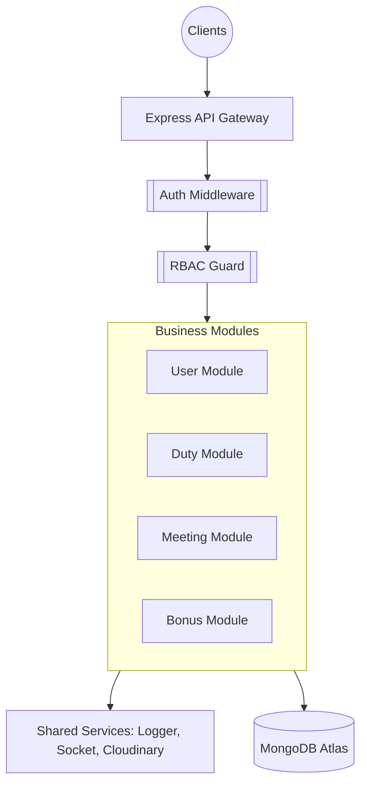

# 🏛️ Master System Architecture Plan

Tài liệu này là bản đồ tổng thể về kiến trúc hệ thống của EduSentia Backend. Để đi sâu vào từng khía cạnh, vui lòng tham khảo các tài liệu chuyên biệt bên dưới.

## 1. Bản đồ Tài liệu (Documentation Map)

| Tài liệu                                                | Nội dung chi tiết                                          |
| :------------------------------------------------------ | :--------------------------------------------------------- |
| [📂 Database Design](./DATABASE_DESIGN.md)              | Sơ đồ ERD, Schemas, Indexing và chiến lược MongoDB.        |
| [🔒 Security Protocol](./SECURITY_PROTOCOL.md)          | JWT, RBAC, Data Protection và Nhật ký bảo mật.             |
| [🛠️ Design Patterns](./DESIGN_PATTERNS.md)              | Repository/Service Pattern, Base Classes và tính đóng gói. |
| [⚡ Real-time Architecture](./REALTIME_ARCHITECTURE.md) | Socket.io, Rooms, Namespaces và Event handling.            |
| [📖 API Development Guide](./API_DEVELOPMENT_GUIDE.md)  | SOP cho việc mở rộng tính năng và chuẩn hóa Codebase.      |

---

## 2. Tổng quan mô hình kiến trúc (High-Level Overview)

Dự án được xây dựng dựa trên triết lý **"Module-First"**, nơi mỗi tính năng nghiệp vụ là một "hộp đen" độc lập nhưng giao tiếp nhịp nhàng thông qua các tầng Service chung.

---

## 3. Các tầng xử lý dữ liệu (Data Processing Layers)

Hệ thống tuân thủ nghiêm ngặt mô hình 4 tầng để đảm bảo tính **Separation of Concerns**:

1. **Routes & Middleware:** Định tuyến và lọc các yêu cầu không hợp lệ ngay từ cửa ngõ.
2. **Controllers:** Đóng vai trò điều phối (Orchestrators), không chứa logic nghiệp vụ.
3. **Services:** Trái tim của hệ thống, nơi xử lý các thuật toán và quy tắc kinh doanh.
4. **Repositories:** Tầng duy nhất được phép "nói chuyện" với Database Models.

---

## 4. Triết lý thiết kế (Design Philosophy)

- **DRY (Don't Repeat Yourself):** Tận dụng tối đa Base Classes và Shared Utils.
- **KISS (Keep It Simple, Stupid):** Code viết ra phải dễ hiểu, dễ đọc hơn là thể hiện sự phức tạp không cần thiết.
- **Fail-Fast:** Hệ thống luôn validate dữ liệu và ném lỗi ngay khi phát hiện bất thường thông qua Middleware tập trung.

---

_Last Updated: 01/05/2026 by EduSentia Architecture Team_
