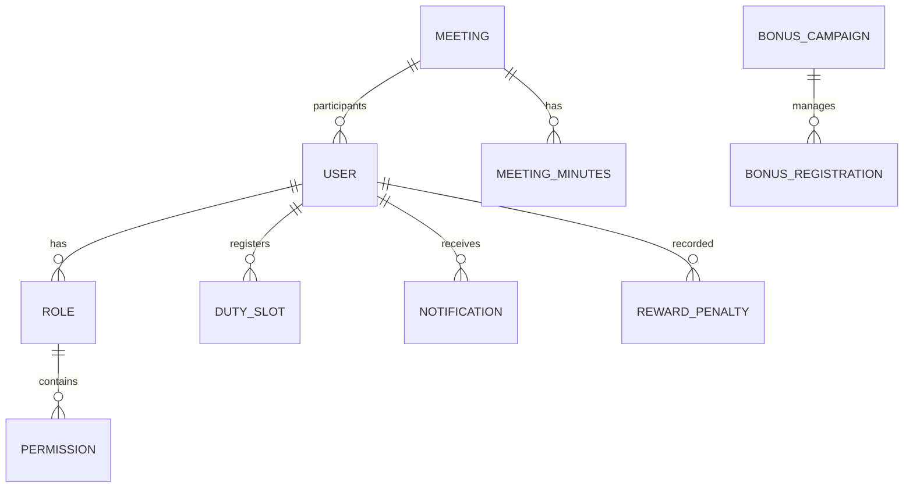

# 🗄️ Database Design & Data Modeling

Tài liệu này mô tả chi tiết kiến trúc dữ liệu và chiến lược lưu trữ của hệ thống Backend, sử dụng MongoDB làm cơ sở dữ liệu chính.

## 1. Sơ đồ quan hệ thực thể (ERD - Conceptual)

Mặc dù MongoDB là NoSQL, hệ thống vẫn duy trì các mối quan hệ logic chặt chẽ để đảm bảo tính toàn vẹn dữ liệu.

---

## 2. Chi tiết các Collection chính

### 👤 Users Module

- **Schema:** `src/modules/users/schemas/user.schema.ts`
- **Đặc điểm:**
  - Lưu trữ thông tin định danh thành viên.
  - Sử dụng `generation` (Khóa) và `semester` để phân loại dữ liệu theo thời gian.
  - Trường `role` liên kết sang Collection `Roles`.
- **Indexes:**
  - Unique Index trên `email` và `username`.
  - Text Index trên `fullName` để hỗ trợ tìm kiếm nhanh.

### 🛡️ Roles & Permissions

- **Schema:** `src/modules/roles/schemas/role.schema.ts`
- **Thiết kế:**
  - Mô hình RBAC (Role-Based Access Control).
  - `Roles` chứa danh sách các `permissions` (dưới dạng mảng các String Key). Điều này giúp kiểm tra quyền hạn với độ phức tạp O(1) hoặc O(n) nhỏ.

### 📅 Duty (Trực nhật)

- **Schemas:** `duty-slot.schema.ts`, `duty-kip.schema.ts`,...
- **Thiết kế:**
  - Sử dụng mô hình "Slot-based". Mỗi ngày trực được chia thành các Kíp (Kip) và mỗi Kíp có các Vị trí (Slots).
  - Quan hệ: `Kip -> Day -> Semester`.

---

## 3. Chiến lược tối ưu hóa (Optimization)

### Đánh Index (Indexing Strategy)

- **Compound Indexes:** Áp dụng cho các truy vấn thường xuyên kết hợp nhiều điều kiện (ví dụ: `semester` + `generation` + `userId`).
- **TTL Indexes:** Sử dụng trong `OtpCode` để tự động xóa các mã xác thực hết hạn sau 5-10 phút.

### Population vs Denormalization

- **Population:** Sử dụng cho các quan hệ 1-N quan trọng (User -> Role) để đảm bảo dữ liệu luôn mới nhất.
- **Denormalization:** Lưu trữ trực tiếp tên người dùng (`fullName`) vào các bản ghi nhật ký (Audit Logs) để tránh Join khi xem báo cáo lịch sử, tăng tốc độ đọc.

---

## 4. Quản lý trạng thái (Enum Patterns)

Tất cả các trạng thái quan trọng (`status`) đều được định nghĩa qua hằng số hoặc Enum tại tầng Schema để tránh lỗi "Magic String".

- `UserStatus`: `active`, `inactive`, `expelled`.
- `MeetingStatus`: `scheduled`, `happening`, `completed`, `cancelled`.

---

_Project Data Engineering Team_
