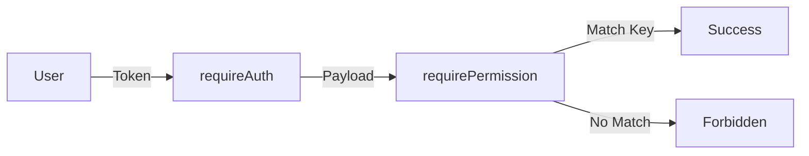

# 🔐 Security Protocol & Data Protection

Tài liệu này trình bày các tiêu chuẩn và cơ chế bảo mật được áp dụng trong hệ thống Backend để đảm bảo tính toàn vẹn, bảo mật và sẵn sàng của dữ liệu.

## 1. Cơ chế Xác thực (Authentication)

Hệ thống sử dụng **JWT (JSON Web Token)** làm phương thức xác thực chính.

### Quy trình cấp phát Token:

1. Người dùng gửi Email/Mật khẩu qua `POST /auth/login`.
2. Backend kiểm tra mật khẩu (đã được băm bằng `bcrypt`).
3. Tạo Access Token chứa `userId` và `role`.
4. Trả về Token kèm thời gian hết hạn (ExpiresIn).

### Bảo mật Token:

- **Secret Key:** Được lưu trữ trong biến môi trường `.env`, không bao giờ commit lên Git.
- **Bearer Schema:** Token phải được gửi qua Header `Authorization: Bearer <token>`.

---

## 2. Mô hình Phân quyền (RBAC - Role Based Access Control)

Chúng ta không kiểm tra quyền trực tiếp theo tên vai trò (ví dụ: `if (user.role === 'admin')`) mà kiểm tra theo **Hành động (Permission Key)**.

### Cấu trúc Middleware:

- **`requireAuth`**: Chặn các yêu cầu không có Token.
- **`requirePermission(key)`**: So khớp Key yêu cầu với danh sách `permissions` trong Role của người dùng.

---

## 3. Bảo vệ dữ liệu (Data Protection)

### Mã hóa mật khẩu

- Sử dụng thuật toán **Bcrypt** với `saltRounds = 10`.
- **Quy tắc:** Tuyệt đối không lưu mật khẩu dạng văn bản thuần (Plain text).

### Ngăn chặn tấn công phổ biến

- **NoSQL Injection:** Sử dụng Mongoose Schemas để ép kiểu dữ liệu đầu vào, ngăn chặn các truy vấn script lạ vào MongoDB.
- **XSS (Cross-Site Scripting):** Mọi dữ liệu đầu vào từ người dùng đều được sanitize qua các middleware xử lý chuỗi.
- **CORS Policy:** Chỉ cho phép các domain được định nghĩa (Frontend) truy cập vào tài nguyên API.

---

## 4. Nhật ký bảo mật (Audit Logging)

Mọi hành động thay đổi dữ liệu (POST, PUT, DELETE, PATCH) đều được ghi lại tự động thông qua module **Audit Logs**.

- **Thông tin lưu trữ:** Người thực hiện, Thời gian, Module tác động, Dữ liệu cũ, Dữ liệu mới, IP Address.
- **Mục đích:** Truy vết khi có sự cố dữ liệu hoặc hành vi xâm nhập trái phép.

---

## 5. Quy trình Reset Mật khẩu & OTP

Cơ chế khôi phục mật khẩu sử dụng mã OTP (One-Time Password) có thời hạn:

- Mã OTP được băm trước khi lưu vào DB.
- Mỗi mã chỉ có hiệu lực trong 5-10 phút (TTL Index).
- Giới hạn số lần thử sai để chống Brute-force.

---

_Project Security Department_
