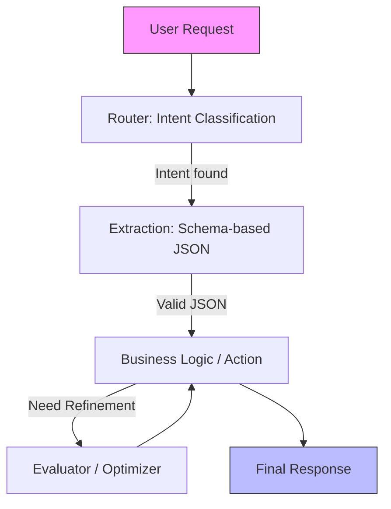

# Backend LLM Pipeline (Efficiency Focused)

Tài liệu này mô tả chi tiết quy trình (pipeline) xử lý AI trên Backend, tối ưu hóa cho tốc độ phản hồi và tiết kiệm Token.

## Sơ đồ luồng xử lý (Modular Workflow)

Quy trình được điều khiển bởi Backend (Node.js), LLM chỉ thực hiện các nhiệm vụ chuyên biệt trong từng bước.

## Các bước thực hiện & Tối ưu Token

### 1. Router Step (Phân loại)

- **Model**: `gpt-5.5-mini` / `gemini-3-flash` (Dự phòng: `claude-4-haiku`).
- **Optimization**: Dùng prompt cực ngắn. Không gửi context nghiệp vụ.
- **Output**: Trả về Enum (ví dụ: `DUTY_LEAVE`).

### 2. Extraction Step (Trích xuất)

- **Model**: `claude-4.6-sonnet` / `gemini-3-flash`.
- **Optimization**: Sử dụng **Native JSON Schema**. Chỉ gửi schema tối thiểu.
- **Output**: JSON object sạch, đã parse.

### 3. Action / Logic Step (Thực thi)

- **Backend Code**: Gọi các Service nghiệp vụ (`DutyService`, `UserService`).
- **LLM Logic**: Chỉ gọi LLM cấp cao (`gpt-5.5`, `claude-4.6-sonnet`) nếu cần suy luận phức tạp.

### 4. Validation Layer (Kiểm soát)

- **Công cụ**: `Zod` / `Joi`.
- **Quy tắc**:
  - Validate schema ngay sau bước Extraction.
  - Áp dụng cơ chế **Cascading Fallback**: Nếu model cấp cao lỗi, hạ xuống model cấp thấp hơn để retry.

## Tại sao chọn mô hình này?

1. **Tiết kiệm chi phí**: Giảm 80-90% token so với việc dùng một Agent lớn đọc toàn bộ docs.
2. **Kiểm soát tuyệt đối**: Tránh việc AI tự ý thực hiện các hành động không được phép.
3. **Dễ Debug**: Lỗi ở bước nào (Router hay Extraction) có thể xác định ngay lập tức.
