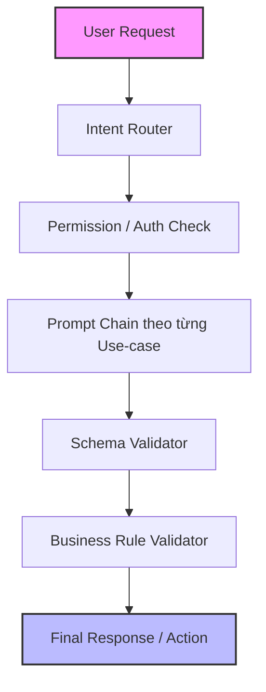

# Proposed Backend LLM Pipeline

Tài liệu này mô tả chi tiết quy trình (pipeline) xử lý yêu cầu người dùng sử dụng mô hình kết hợp (Prompt Chaining + Routing + Validation) được đề xuất cho Backend.

## Sơ đồ luồng xử lý (Workflow Diagram)

Sơ đồ dưới đây thể hiện đường đi của một `User Request` qua các node xử lý của hệ thống trước khi trả về `Final Response`.

## Chi tiết các bước thực hiện (Step-by-Step Implementation)

### 1. Router Prompt (Phân luồng intent)

Bước đầu tiên tiếp nhận câu nói/yêu cầu của người dùng bằng ngôn ngữ tự nhiên và phân loại nó.

- **Mục tiêu:** Xác định xem người dùng đang muốn làm gì (auth, check permission, xếp lịch duty shift, lấy report...).
- **Hành động:** Trả về một `intent_category` rõ ràng.

### 2. Extraction Prompt (Trích xuất dữ liệu)

Sau khi đã định tuyến đúng luồng, LLM tiến hành phân tích câu nói để lấy ra các tham số nghiệp vụ.

- **Mục tiêu:** Lấy được dữ liệu cụ thể cần thiết từ câu hỏi để thực hiện tác vụ (ví dụ: ngày tháng, ID nhân viên, role cần cấp).
- **Kết quả:** JSON object chứa các tham số thô.

### 3. Business Prompt (Xử lý nghiệp vụ)

Đưa các tham số và logic nghiệp vụ vào prompt để LLM giải quyết bài toán cốt lõi.

- **Mục tiêu:** Áp dụng logic và các rule nghiệp vụ cụ thể của hệ thống.
- **Ví dụ:** Dựa trên context lịch hiện tại và tham số trích xuất được, tạo lịch trực (duty) cho nhân viên sao cho hợp lý, hoặc sinh một truy vấn cơ sở dữ liệu.

### 4. Validation Step (Bước kiểm định)

Sau khi có đầu ra từ LLM, bắt buộc phải có bước kiểm định. Có thể kết hợp Evaluator Prompt và các schema validator code (như Zod/Joi).

- **Mục tiêu:**
  - Kiểm tra format output (đúng chuẩn JSON, đủ các field bắt buộc).
  - Đảm bảo không vượt quá giới hạn quyền (không thực hiện hành vi nguy hiểm).
- **Hành động:** Nếu sai, kích hoạt cơ chế retry (Optimizing/Refining) để LLM tự sửa lỗi, hoặc fallback báo lỗi.

### 5. Final Response (Trả kết quả)

- **Mục tiêu:** Gọi service backend (gọi API, lưu DB) hoặc tạo câu trả lời tự nhiên hiển thị cho người dùng.
- **Hành động:** Hoàn tất chu trình.

## Chiến lược triển khai (Deployment Strategy)

1.  **Giai đoạn 1:** Xây dựng luồng có cấu trúc chặt chẽ.
    - _Mô hình:_ `Prompt Chaining` + `Validator`.
    - _Áp dụng:_ Nếu workflow của nghiệp vụ đó rất rõ ràng, từng bước tuần tự.
2.  **Giai đoạn 2:** Mở rộng linh hoạt.
    - _Mô hình:_ Bổ sung thêm `Routing`.
    - _Áp dụng:_ Khi endpoint tiếp nhận nhiều loại yêu cầu (ví dụ một con Chatbot chung cho nhiều tính năng).
3.  **Giai đoạn 3:** Tự động hóa cao độ (Chỉ khi thật sự cần).
    - _Mô hình:_ `Agentic Workflow`.
    - _Áp dụng:_ Cần model tự động gọi API/DB/Tools nhiều lần lặp để đạt mục tiêu, nhưng phải thiết lập giới hạn tool rõ ràng để tránh rủi ro an ninh.
